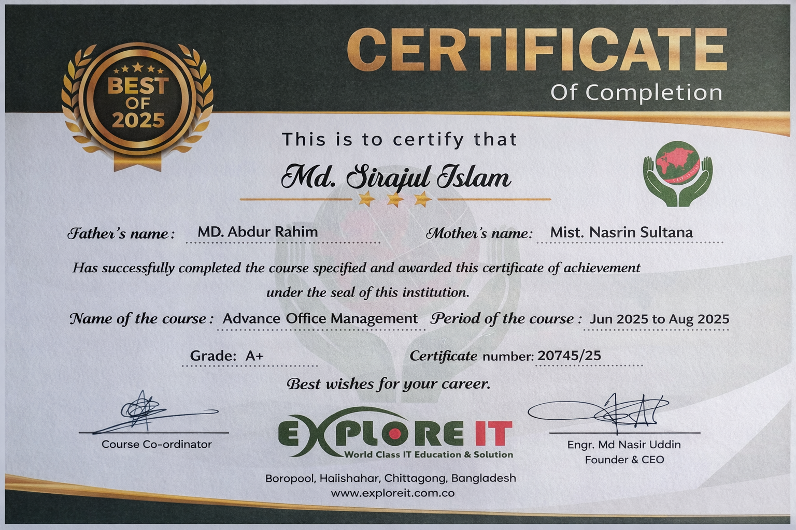

# Advanced Office Management - Professional Course 

## Course Info: 
- Course Title: Advanced Office Management 
- Lead Instructor: Engr. Md. Nasir Uddin 
- Course Duration: 12 weeks (3 Classes/Week, 2 Hours Each) 
- Total Sessions: 36 Live Classes + 1 Final Assessment 
- Mode: Offline 
- Certification: A Course Completion Certificate has been provided 
- About Certificate: The provided certificate is a hardcopy 
- Resources Included: PDF Notes & Practice Files 

---

## Core Skills: 
- Professional Document Formatting & Styling 
- Report & Resume Writing 
- Data Entry, Cleaning & Organization
- Formulas & Functions for Business Calculations 
- Data Analysis Using Pivot Tables 
- Dashboard Building with Charts 
- Table Formatting 
- Creating Professional Business Presentations 
- Visual Storytelling with Slide Design & Infographics 
- Cloud-Based Collaboration (Docs, Sheets, Slides)
- Google Drive & Gmail 
- Office Productivity & Workflow Management 

--- 

## Certificate: 

---

> *The program was a fully offline version, so the certificate is included here along with the full course structure.*
